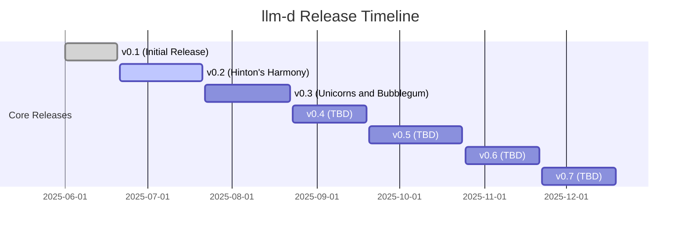
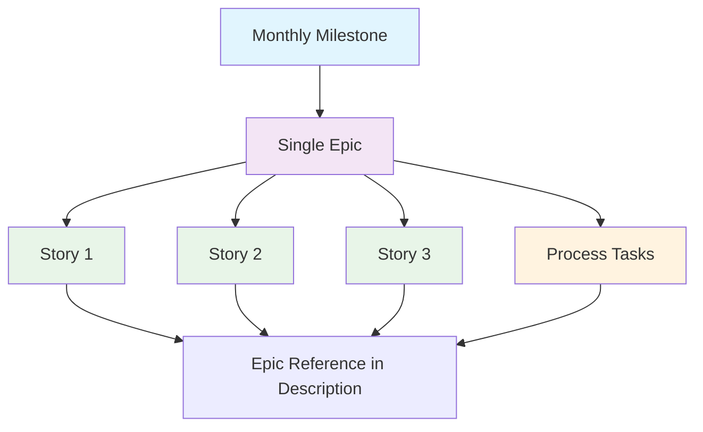
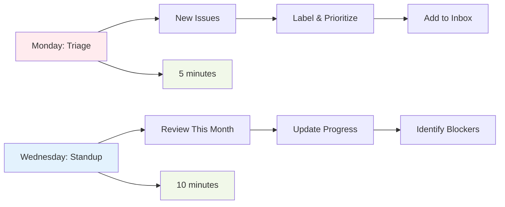
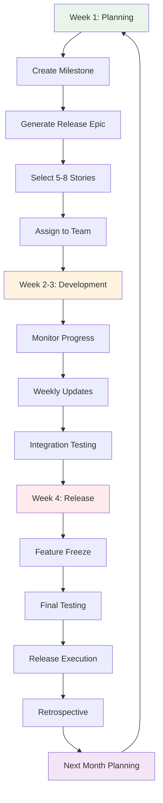
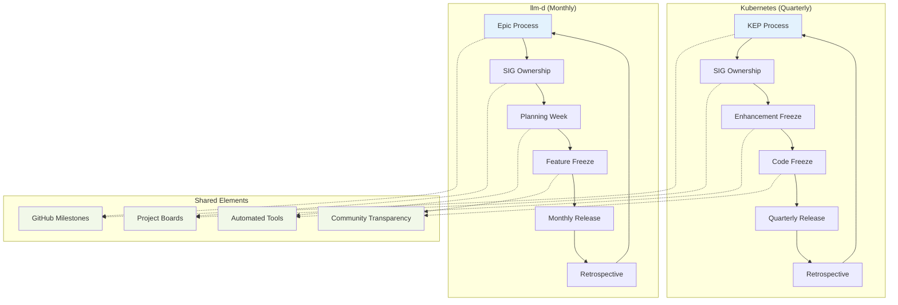
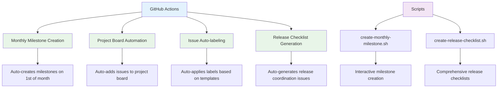

# project-test-llm-d

This repository demonstrates a mature, lightweight project management workflow for the [llm-d project](https://github.com/llm-d/llm-d) with monthly releases, automated processes, and Red Hat ↔ Open Source integration.

## 🎯 Purpose
- Demonstrate GitHub Projects workflow for monthly releases
- Show Red Hat ↔ Open Source integration patterns
- Validate automated release processes
- Test epic-milestone organizational structure

## 📋 Project Board
[View the Project Board](https://github.com/users/jeremyeder/projects/6) to see:
- **Release Pipeline**: 4-column kanban (Inbox → This Month → In Progress → Done)
- **Monthly Roadmap**: Timeline view of upcoming milestones
- **Epic Tracking**: Each milestone contains exactly one epic
- **Story Organization**: Stories reference parent epics rather than direct milestone assignment

## 📈 Release Timeline



## 🔄 Process Overview

### Epic-Milestone Structure
Each milestone contains exactly **one epic** that coordinates all release activities. Stories reference their parent epics through descriptions rather than direct milestone assignments.



### Weekly Process (15 minutes total)



### Monthly Release Cycle (4 weeks)



## 🔄 Kubernetes-Inspired Workflow

This workflow follows battle-tested patterns from Kubernetes, adapted for faster monthly releases while maintaining the quality and community-driven approach that makes Kubernetes successful.

### Why Reference Kubernetes?
The Kubernetes project has proven that structured, time-based releases with strong community collaboration can scale to massive projects. Our workflow adapts these proven patterns for faster iteration cycles.



### Key Similarities to Kubernetes

| **Aspect** | **Kubernetes** | **llm-d** | **Benefit** |
|------------|---------------|-----------|------------|
| **Release Cadence** | Quarterly (4 months) | Monthly | Predictable, time-based releases |
| **Planning Process** | KEP (Kubernetes Enhancement Proposal) | Epic-driven development | Upfront design and coordination |
| **Organization** | SIGs (Special Interest Groups) | SIGs + Component-based labels | Clear ownership and expertise areas |
| **Milestone Tracking** | GitHub milestones with `/milestone` | Epic-milestone 1:1 relationship | Release-focused organization |
| **Project Management** | GitHub Project Boards (2024 migration) | GitHub Project Boards | Transparent, GitHub-native workflow |
| **Release Coordination** | Dedicated Release Team with roles | Release coordination issues (building dedicated team) | Structured, role-based execution |
| **Quality Gates** | Enhancement freeze + Code freeze | Feature freeze (Week 3) | Stability through controlled changes |
| **Automation** | Custom tools, receipts process | GitHub Actions, automated scripts | Reduced manual overhead |
| **Community** | Open participation, transparency | Community labels, open planning | Inclusive, collaborative development |
| **Improvement** | Regular retrospectives, process evolution | Monthly retrospectives | Data-driven process refinement |

### What We Adapted for Faster Cycles

- **Monthly vs Quarterly**: Shorter cycles for faster feedback and delivery
- **Epics vs KEPs**: Lightweight coordination without heavy design documents
- **SIGs + Component Labels**: SIG ownership with granular component tracking
- **Release Team Evolution**: Building dedicated release team while using coordination issues
- **Automated Workflows**: More GitHub Actions integration for rapid iteration

### Familiar to Kubernetes Contributors

If you've worked with Kubernetes releases, you'll recognize:
- **Milestone-driven development** with clear release boundaries
- **Freeze periods** to ensure quality and stability
- **Release coordination** with structured checklists and responsibilities
- **GitHub Project Boards** for transparent progress tracking
- **Community-first approach** with open planning and participation

This isn't "invented here" – it's proven patterns from one of the most successful open-source projects, optimized for monthly delivery cadence.

## 🤖 Automation & Tools

The project includes comprehensive automation to reduce manual overhead:



### Automation Files
- **Monthly Milestone Workflow**: `.github/workflows/monthly-milestone.yml`
- **Project Board Automation**: `.github/workflows/project-automation.yml`
- **Weekly Report Generation**: `.github/workflows/weekly-report.yml`
- **Milestone Creation Script**: `.github/scripts/create-monthly-milestone.sh`
- **Release Checklist Generator**: `.github/scripts/create-release-checklist.sh`

## 🏷️ Labels

### Priority
- `priority/urgent` - Red Hat customer blocker
- `priority/high` - Must have for monthly release
- `priority/medium` - Should have 
- `priority/low` - Nice to have

### Type  
- `type/epic` - Multi-story initiative (assigned to milestones)
- `type/story` - Single feature/fix (references parent epic)
- `type/task` - Implementation detail (references parent epic)
- `type/bug` - Something broken

### Component
- **Core**: `component/scheduler`, `component/kv-cache`, `component/routing`, `component/docs`
- **Extensions**: `component/benchmark`, `component/deployment`

### Release Management
- `core-release` - Core component release
- `extension-release` - Extension component release
- `rh-priority` - Red Hat commercial requirement
- `blocked` - Cannot proceed
- `community` - External contributor

## 📊 Success Metrics
We track 3 simple metrics:
1. **Velocity**: Issues closed per month
2. **Community**: New contributors per month  
3. **Quality**: Customer-reported bugs per release

## 🤝 Red Hat Integration
Customer requirements flow into the open source backlog via:
1. Create GitHub issue with `rh-priority` label
2. Community discussion on approach
3. Implementation upstream-first
4. Include in Red Hat product releases

## 📚 Resources & Documentation

### Process Templates
- **Monthly Planning**: [`docs/monthly-planning-template.md`](docs/monthly-planning-template.md)
- **Weekly Review**: [`docs/weekly-review-template.md`](docs/weekly-review-template.md)

### Release Management
- **Active Release Checklists**: Search issues for "Release Planning and Coordination"
- **v0.1 Release Checklist**: [Issue #38](../../issues/38)
- **v0.2 Release Checklist**: [Issue #16](../../issues/16)
- **v0.3 Release Checklist**: [Issue #27](../../issues/27)
- **v0.4 Release Checklist**: [Issue #34](../../issues/34)

### Automation Scripts
- **Generate Monthly Milestone**: `.github/scripts/create-monthly-milestone.sh`
- **Create Release Checklist**: `.github/scripts/create-release-checklist.sh`

## 🚀 Current Release Status

### Active Releases
- **v0.2 (Hinton's Harmony)**: July 21, 2025 - Disaggregated serving architecture
- **v0.3 (Unicorns and Bubblegum)**: August 22, 2025 - Whimsical features and magical improvements

### Upcoming Releases
- **v0.4**: September 19, 2025 - Theme TBD
- **v0.5**: October 24, 2025 - Theme TBD
- **v0.6**: November 21, 2025 - Theme TBD
- **v0.7**: December 19, 2025 - Theme TBD

## 🚀 Demo Features

This repository demonstrates:
- **43 Sample Issues**: Comprehensive set of epics, stories, tasks, and bugs
- **7 Monthly Milestones**: Each with a single coordinating epic
- **Epic-Story Hierarchy**: Stories reference parent epics via descriptions
- **Automation Integration**: GitHub Actions and scripts for process automation
- **Red Hat Priority Examples**: Customer requirements with `rh-priority` labels
- **Community Contribution Examples**: External contributor scenarios
- **Release Process**: Full monthly release cycle with coordination issues

## ⚡ Getting Started

1. **Explore the Project Board**: [View Project Board](https://github.com/users/jeremyeder/projects/6)
2. **Review Sample Issues**: Browse the Issues tab to see the organizational structure
3. **Check Release Checklists**: Review active release coordination issues
4. **Run Automation**: Test the milestone creation and release checklist scripts
5. **Conduct Weekly Review**: Use the weekly review template with your team

## 🔧 Advanced Usage

### Creating New Milestones
```bash
# Interactive milestone creation
./.github/scripts/create-monthly-milestone.sh

# Specific version and month
./.github/scripts/create-monthly-milestone.sh "v0.8" "January"
```

### Generating Release Checklists
```bash
# For current milestone
./.github/scripts/create-release-checklist.sh

# For specific version
./.github/scripts/create-release-checklist.sh "v0.8"
```

### GitHub Actions Triggers
- **Monthly Milestone**: Automatically runs on 1st of each month
- **Project Automation**: Triggers on issue creation/updates
- **Weekly Reports**: Configurable schedule for team updates

---

**The goal: Process should enable speed, not replace it.**

*This project demonstrates a mature, automated project management workflow that scales with team growth while maintaining simplicity and focus on delivery.*